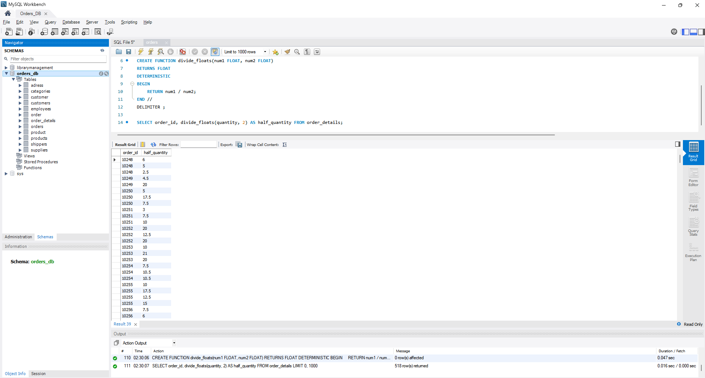

## Home task. Nested requests. Code reuse

#### Task Instructions

1. Write a SQL query to display the `order_details` table alongside the `customer_id` field from the `orders` table, associating them with each record in the `order_details` table.

This should be accomplished using a nested query within a `SELECT` statement.

2. Write an SQL query to display the `order_details` table, filtering the results to include only those records where the corresponding entry in the `orders` table has a `shipper_id of 3`.

This should be achieved using a nested query within the `WHERE` clause.

3. Write an SQL query that selects rows `FROM` the `order_details` table where the `quantity > 10`. Then, calculate the average value of the `quantity` field for the retrieved data, grouping by `order_id`.

4. Solve problem 3 by utilizing the `WITH` statement to create a temporary table named `temp`. If your MySQL version is earlier than 8.0, construct this query following the same approach as demonstrated in the synopsis.

5. Develop a function with two parameters that divides the first parameter by the second. Ensure that both the parameters and the return value are of type `FLOAT`.

Utilize the `DROP FUNCTION IF EXISTS` construct. Then, apply the function to the `quantity` attribute of the `order_details` table.

